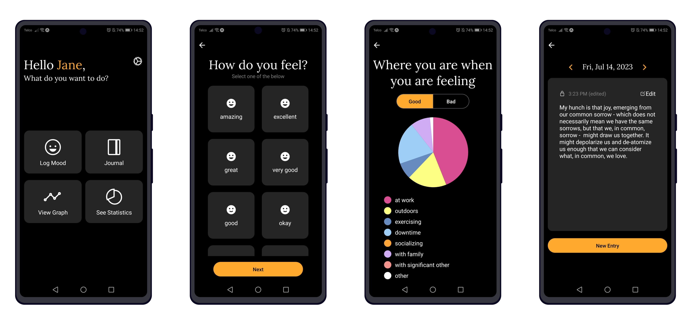

# Mood Minder

## Table of contents
- [About the App](#about-the-app)
- [Technical](#technical)
- [Contributing](#contributing)
- [Licence](#license)

## About the App

Mood Minder is a mobile micro-journal and mood tracker app designed to enhance your mindfulness journey through the principles of Cognitive Behavioural Therapy (CBT). Effortlessly track your moods and thoughts throughout the day to help you better understand and navigate your emotional landscape.  
  
Cultivate mindfulness as you gain valuable insights into your fluctuating moods. By documenting your emotional shifts, you'll begin to recognize that nothing lasts forever, and even the darkest moments will eventually give way to positivity and growth. Uncover the hidden patterns that influence your emotional well-being and identify the contexts in which you thrive, and those that challenge you, empowering you to address and overcome obstacles with more self-awareness.

## Features

- **Instant Mood Log**: Effortlessly record your moods with a simple tap, allowing you to capture the essence of each moment quickly and effectively.
- **Mini Journal**: Expand on your emotions, or jot down anything that is on your mind wherever you are.
- **Reflective Check-Ins**: See the ever-shifting ups and downs of life and monitor your personal growth and journey towards emotional balance through it all.
- **Mindful Insights**: Gain a better understanding of the connections between your thoughts, moods, and external influences by seeing where you are when you are feeling good or bad.

## Demo

## Technical

### Technologies Used

 

### Development Setup

1. Install and set up the [API server](https://github.com/mhanki/Mood-Minder-API).
2. Clone the repository: `git clone https://github.com/mhanki/Mood-Minder.git`
3. Install dependencies: `npm install`.
4. Start the app with `npm start`.
5. Open the app on your emulator or phone via [Expo](https://expo.dev/).

## Contributing

Found a **bug** or have a concrete **feature request**? Open a corresponding issue through the [Issues Tab](https://github.com/mhanki/Mood-Minder/issues).

## License

This project is licensed under the MIT License. See the [LICENSE](LICENSE) file for more information.
